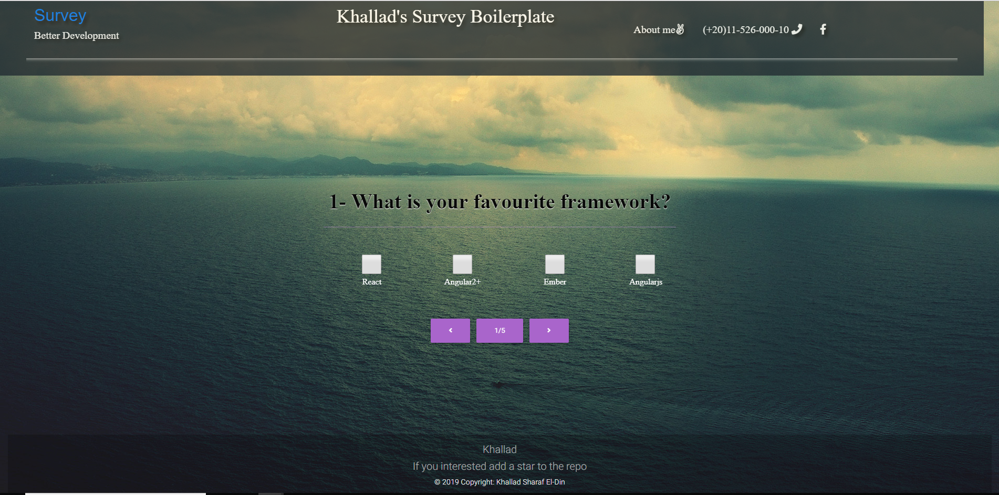

# Survey with (Reactjs/Jest/MDB)
Simple Survey 

## Getting Started
There are few easy steps:
- clone the repository
- cd to the directory with the repository
- run `npm install` 
- run the app using `npm start` then press `a` to run all test-cases
- run test-units using `npm test`
- enjoy!

## Something Missing?
If something went wrong please contact me 
khallad_3@hotmail.com
(+20)011-526-000-10 

